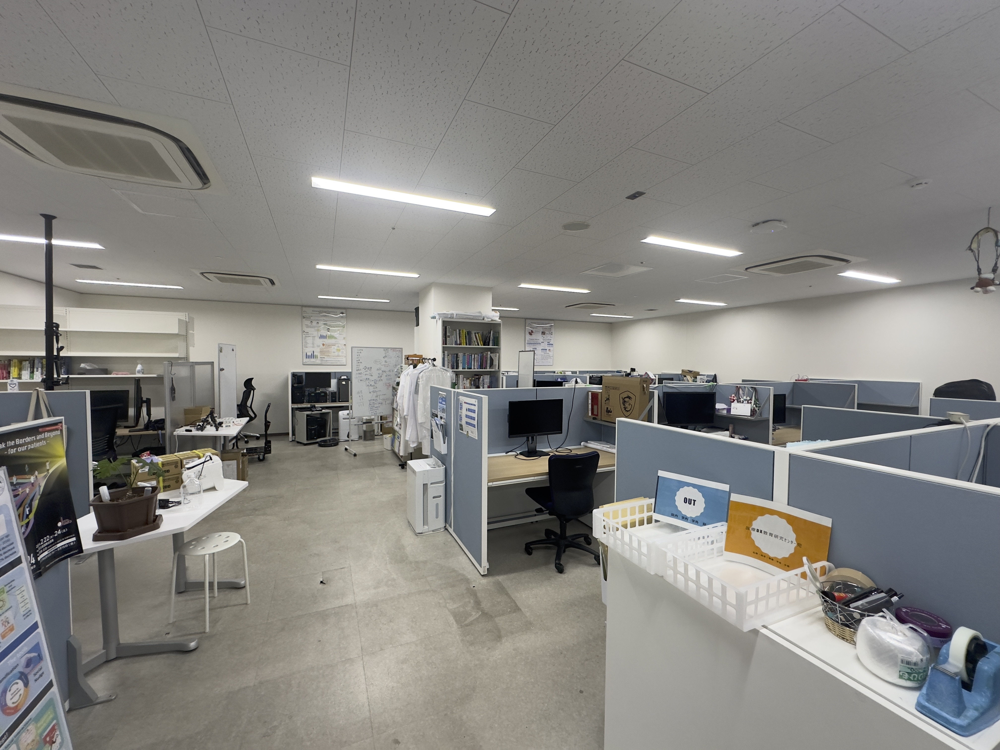

# 医疗情报学研究室

[医疗情报学研究室主页](https://medinfo.kuhp.kyoto-u.ac.jp/)

教授：黑田知宏 Kuroda Tomohiro

研究方向：手术室状况理解，电子病历

难易度：未知

```tip
观察是每年招三个人，外国留学生一般只收一个。
博士生外国留学生比较多。。
```

研究室环境：



```note
地下室一层，没有阳光☀️，容易emo！
```

## 毕业条件

学会发表两次。

## 日常活动

每周一上午9:00～12:00 研究会

每周五 上午9:00～12:00 学习会

## 设备

32 Cores 128GB 5 GPUs（Titan） 服务器虚拟机

## 其他

有零食Corner，Drink Bar

因为黑田教授经常去欧洲开会，所以不定期能吃到来自欧洲各个国家的点心
